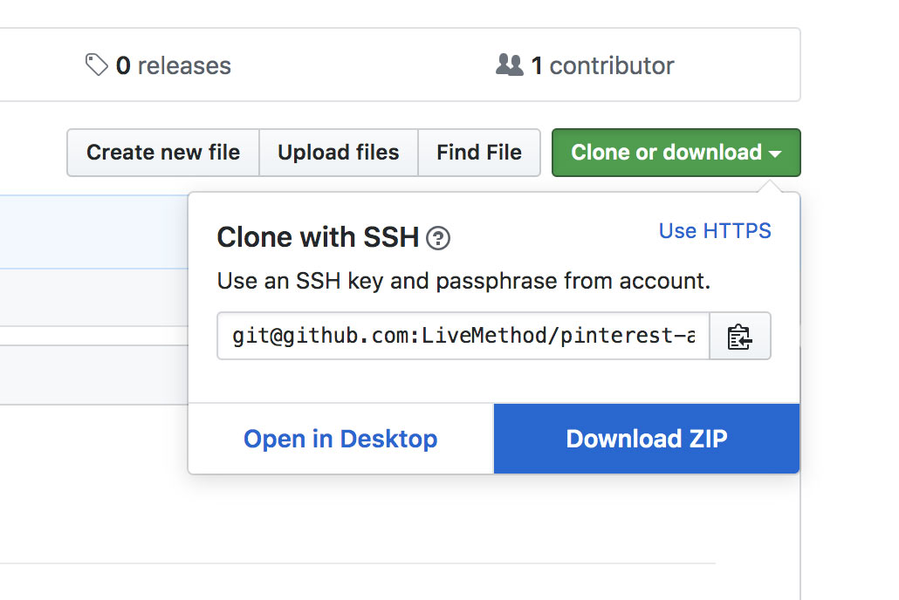
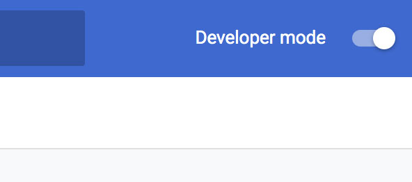
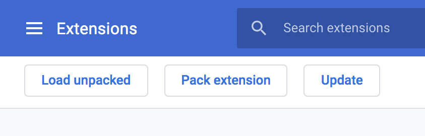
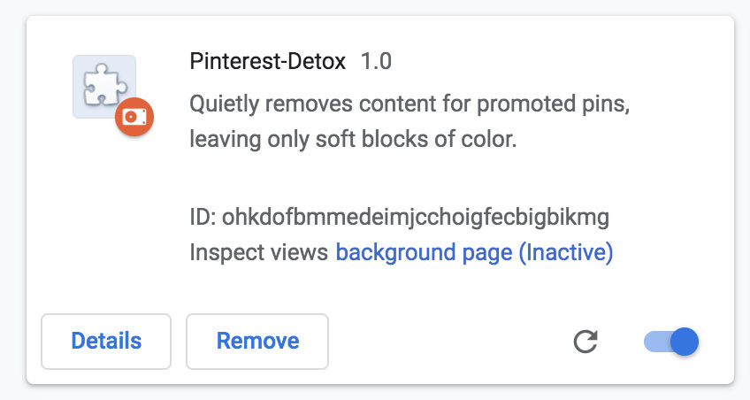

# TODO

I'm too lazy to deal with this just this scecond, but here's the issue  with the sinlge pin thing:

"Unchecked runtime.lastError: Could not establish connection. Receiving end does not exist."

Apparently there's some kind of socket-like connection API that needs to be opened between some combination of the background script, the content script, and the runtime (??)

One of the ways this error occurs is when a message attempts to be sent but the connection has not been properly opened. The error makes it sound like it's the content script side that doesn't exist, since that's the receiving end.

# Pinterest Adblock
A chrome extension that quietly removes content for promoted pins, leaving only soft blocks of color.

## Example:
The blank blocks in this screenshot would have been advertisements

## Install:

1) Download the folder

2) Visit `chrome://extensions/` in your URL bar and check the box for Developer mode in the top right.

3) Select "Load unpacked extension"

4) Load the `pinterest-adblock` folder downloaded in step 1

5) Enjoy