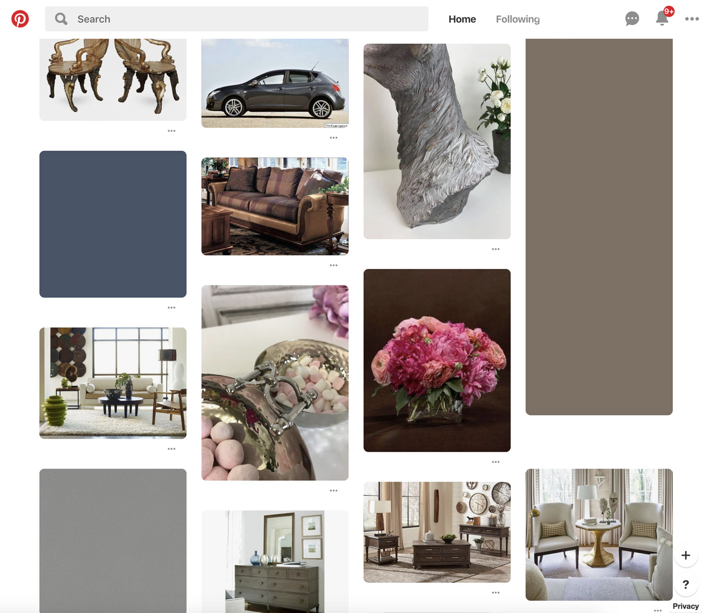

# Pinterest Adblock
A chrome extension that quietly removes content for promoted pins, leaving only soft blocks of color.

## Example:
The blank blocks in this screenshot would have been advertisements

## Install:

1) Download the folder

2) Go to [chrome://extensions/](chrome://extensions/) and check the box for Developer mode in the top right.

3) Select "Load unpacked extension"

4) Load the `pinterest-adblock` folder downloaded in step 1

5) Enjoy